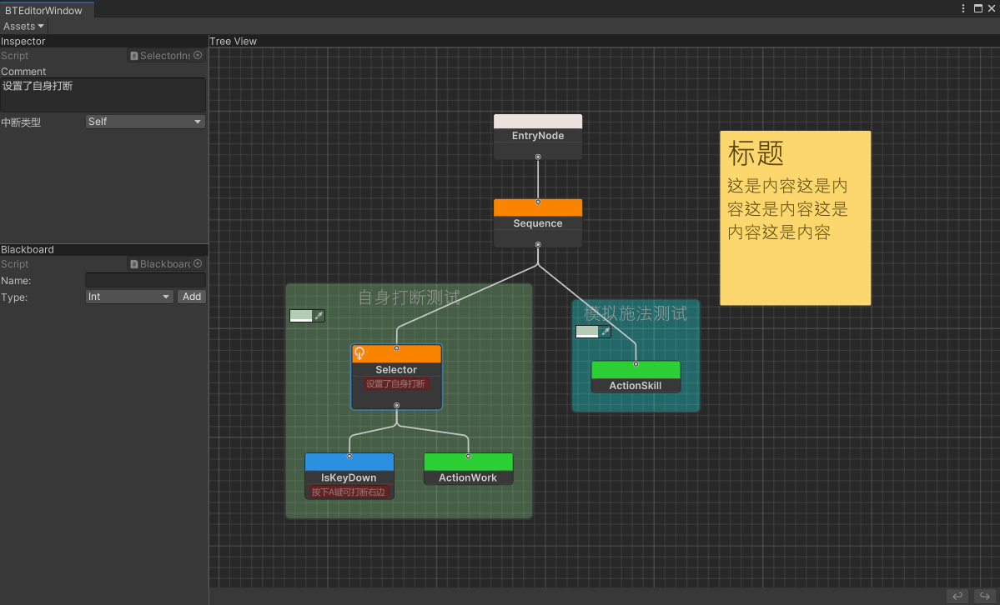
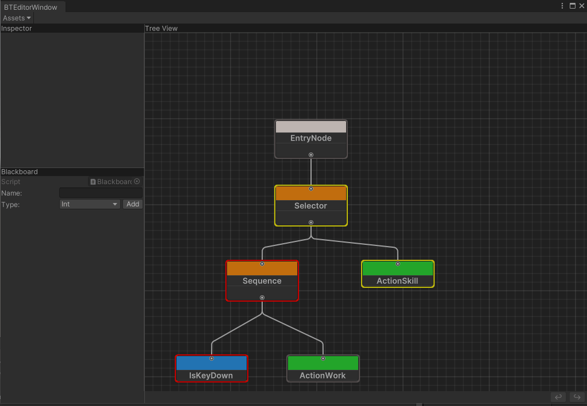

# BehaviorTreeEditor

#### 目录结构

- BTCore
  - Data：BT数据导出目录，主要为json格式。
  - Editor：编辑器部分，引用到Odin插件做编辑处理。
  - Runtime：注意Runtime部分需要支持脱离Unity环境运行，因此不能引用到任何Unity相关API和特性，只用到了一个第三方json序列化库**Newtonsoft.Json**方便序列化处理数据，你也可以替换为其他序列化保存方式。
  - Runtime.Unity：需要引用Unity部分的代码请放入这个目录，目前暂未实现主体逻辑，待扩展。

#### 使用说明

若只在Unity里面用，正常使用即可，挂载上BehaviorTree组件，或者其他反序列化BT数据后做Tick操作即可。当需要支持BT.Runtime部分脱离Unity环境运行，用于服务端或者帧同步框架上时，可以直接拷贝源码，或者独立生成BTRuntime.dll到外部工程，引用上Newtonsoft.Json即可。节点的Inspector面板和黑板面板都是用Odin插件实现编辑效果，支持节点变量绑定黑板数据，实现逻辑可以看BTCore.Editor部分代码。

##### 功能实现

- [x] 行为树节点数据编辑，黑板功能实现
- [x] 支持节点赋值粘贴、撤销回退，运行时预览状态
- [x] 右键实现节点分类搜索框、选中自动生成对应节点
- [x] 实现组合节点3种中断机制，Self、LowerPriority、Both
- [x] 增加对单个节点的注释，新增节点Group、StickyNotes(版本需2020往上)

##### 效果图

Group、StickNote在节点搜索框分类的Others里面。注意按住Shift建后，再点击Group里面的节点才能拖拽出组！

#### 节点中断机制

增加了组合节点的中断功能，如图所示Sequence设置了LowPriority，当按钮按下时，能够打断右边的持续性Action节点运行，整体思路可参考BehaviorDesigner

#### 外部工程使用说明

打开Scenes/2. ExternalNode.unity场景，里面有提供一个简单的示例Demo，相关脚本在Examples/ExternalNode目录下。提供了Condition，Action外部节点类型扩展，一般来说外部工程的代码不放到Unity里面，无法识别具体的类型，Unity侧提供了ExternalCondition，ExternalAction两个节点做编辑占位处理。在每个节点Inspector上有对应的映射字段TypeName便于创建对应外部类型，Properties字段方便向外部传递数据。运行时会将占位节点替换为具体映射类型，然后重建树节点之间的连接关系。

#### 已知问题

~~装饰节点在已有子节点的情况下，直接拖拽新的子节点可能会导致BT数据部分对不上~~
注意目前Group、StickNote节点不支持撤销、回退！！！

#### 参考

- https://github.com/thekiwicoder0/UnityBehaviourTreeEditor
